# Aotz - Brush package optimized for OpenToonz

Aotz is a MyPaint brush pack builded to OpenToonz. 

</img> 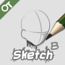</img> </img> </img> 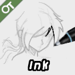</img> </img> </img> </img> </img> </img> 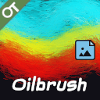</img> 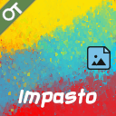</img> 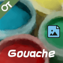</img> 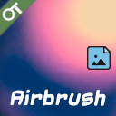</img> </img> </img> </img> </img> 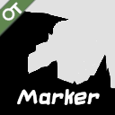</img> 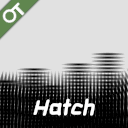</img> 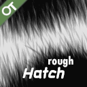</img> </img> 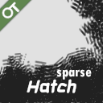</img> 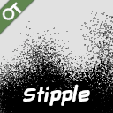</img> </img> </img> </img> 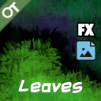</img> 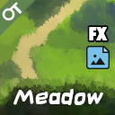</img> </img> 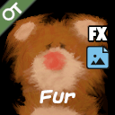</img> </img> 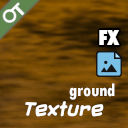</img> 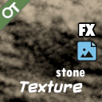</img> 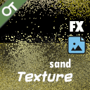</img> </img> 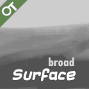</img> 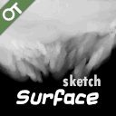</img> 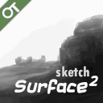</img> 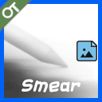</img> 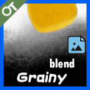</img> </img> 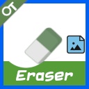</img>

Recommended to use stable or nightly versions of Opentoonz.

Author & License
-----------------
Created by Anderson Prado (AndeOn)

Licensed as Public Domain, CC0, free to use

Notes
-----

[OpenToonz](https://opentoonz.github.io/) is a 2D animation software published by DWANGO. It is based on Toonz Studio Ghibli Version, originally developed in Italy by Digital Video, Inc., and customized by Studio Ghibli over many years of production.

